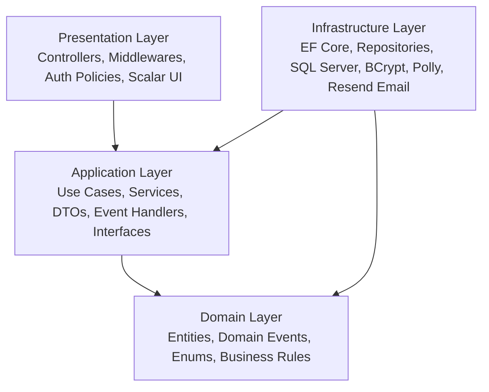
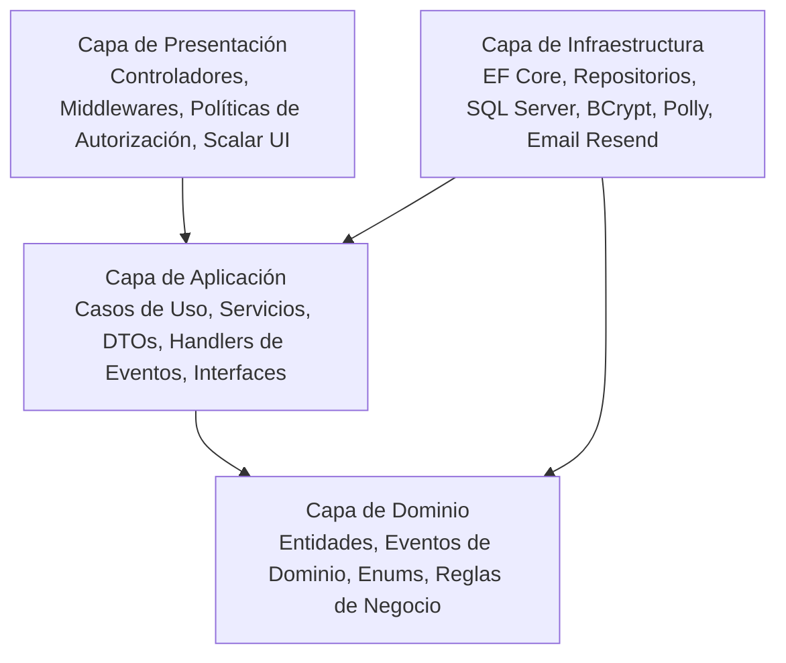

<a id="english-version"></a>

# Hospital Appointment Management API

[](https://dotnet.microsoft.com/)
[](https://learn.microsoft.com/dotnet/csharp/)
[](https://learn.microsoft.com/ef/core/)
[](https://www.microsoft.com/sql-server)
[](https://jwt.io/)
[](https://scalar.com/)
[](https://azure.microsoft.com/)

> **A robust, scalable RESTful API for hospital appointment scheduling, user management, and electronic medical histories built with .NET 10, C#, and Clean Architecture.**

---

🌐 **Languages / Idiomas:** [English](#english-version) | [Español](#spanish-version)

---

## 📑 Table of Contents
- [Project Overview](#-project-overview)
- [Architecture & Design Principles](#-architecture--design-principles)
- [Key Features](#-key-features)
- [Tech Stack & Libraries](#-tech-stack--libraries)
- [Security & Resilience](#-security--resilience)
- [Domain Events & Notifications](#-domain-events--notifications)
- [Database & Persistence](#-database--persistence)
- [API Reference](#-api-reference)
- [Getting Started](#-getting-started)
  - [Prerequisites](#prerequisites)
  - [Installation & Configuration](#installation--configuration)
  - [Running the Application](#running-the-application)
  - [Default Seed Data & Credentials](#default-seed-data--credentials)
- [CI/CD & Cloud Deployment](#-cicd--cloud-deployment)

---

## 🏥 Project Overview

The **Hospital Appointment Management API** is a backend system engineered to streamline outpatient clinic operations. It solves common medical administrative bottlenecks such as room conflicts, doctor availability mismatches, double-booking, and access control across different administrative and clinical roles.

The project demonstrates production-grade software engineering practices, applying **Clean Architecture (Onion Architecture)**, **Domain-Driven Design (DDD)** concepts, **Repository & Specification patterns**, **Domain Event Dispatching**, and **Resilient External HTTP Integration**.

---

## 🏛 Architecture & Design Principles

The solution strictly adheres to **Clean Architecture** principles to achieve decoupling, testability, and high maintainability.



### Layer Breakdown

1. **`Domain` (Enterprise Business Rules)**
   - Core entities: `User`, `Patient`, `Doctor`, `Administrator`, `Receptionist`, `Appointment`, `MedicalHistory`, `Room`.
   - Domain Events: `AppointmentCreatedEvent`, `AppointmentCanceledEvent`, `AppointmentChangedEvent`.
   - Enums: `Specialty`, `AppointmentState`, `UserRole`.
   - Pure C# with zero external dependencies, enforcing domain invariants and encapsulating state transitions.

2. **`Application` (Application Business Rules)**
   - Orchestrates use cases and transactional workflows (`AppointmentService`, `UserService`, `AuthService`, `MedicalHistoryService`, `RoomService`).
   - Abstractions: interfaces for repositories, external services, current user context, and event handlers.
   - Data Transfer Objects (DTOs) and request validation contracts.
   - Domain Event Handlers (e.g., triggering automated email notifications upon scheduling/cancellation).

3. **`Infrastructure` (Frameworks & Drivers)**
   - Data persistence using **Entity Framework Core 10** with **SQL Server**.
   - Generic and specialized repositories (`Repository<T>`, `AppointmentRepository`, `MedicalHistoryRepository`).
   - Database seeding and automatic migration pipeline (`ApplicationDbContextInitialiser`).
   - Third-party email delivery via **Resend API** encapsulated with **Polly** resilience policies (retry with exponential backoff and circuit breaker).
   - Password hashing with **BCrypt**.

4. **`Presentation` (Interface Adapters / Web API)**
   - RESTful Controllers exposing HTTP endpoints.
   - **JWT Bearer Authentication** and fine-grained **Role/Policy-Based Authorization** (`AdministratorOnly`, `Staff`, `StaffAndDoctor`).
   - Global `ExceptionHandlingMiddleware` mapping application/domain exceptions to structured JSON error responses.
   - Interactive OpenAPI documentation using **Scalar**.

---

## ✨ Key Features

- **Role-Based Access Control (RBAC):** Hierarchical permissions across four distinct user roles (`Administrator`, `Doctor`, `Receptionist`, `Patient`).
- **Conflict-Free Appointment Scheduling:**
  - Enforces 30-minute operational time slots (09:00 to 20:00).
  - Validates that doctor specialty matches the assigned room specialty.
  - Automatically prevents room double-booking and doctor schedule overlaps.
  - Controls appointment lifecycle transitions (`Confirmed` -> `Completed` or `Canceled`).
- **Electronic Medical Records:** Doctors can register clinical diagnostics and link medical notes directly to completed appointments.
- **Audit Logging & Soft Deletes:** Base entities track `CreatedAt`, `UpdatedAt`, `DeletedAt`, and `IsDeleted` flags with global EF Core query filters.
- **Transactional Notifications:** Real-time email confirmations sent to patients upon appointment creation, updates, and cancellations.
- **Centralized Package Management (CPM):** Dependency versions unified across all projects using `Directory.Packages.props`.

---

## 🛠 Tech Stack & Libraries

| Category | Technology / Library | Description |
| :--- | :--- | :--- |
| **Runtime & Language** | .NET 10, C# 13 | High-performance backend runtime and modern language features |
| **Architecture** | Clean Architecture / DDD | Layered separation of concerns and domain event handling |
| **ORM & Data** | Entity Framework Core 10 | Code-First migrations, LINQ queries, and relational mapping |
| **Database** | Microsoft SQL Server | Relational database with filtered indexes and soft-delete support |
| **Security** | JWT Bearer & BCrypt.Net-Next | Token-based stateless authentication and salted password hashing |
| **Resilience & HTTP** | Polly (`Microsoft.Extensions.Http.Polly`) | Transient fault handling: exponential backoff retry & circuit breaker |
| **Email Service** | Resend API (`HttpClient`) | Transactional email delivery service |
| **API Documentation** | Scalar (`Scalar.AspNetCore`) & OpenAPI | Next-generation interactive API testing UI |
| **DevOps & Cloud** | GitHub Actions & Azure App Service | Continuous Integration and Cloud Deployment pipeline |

---

## 🔒 Security & Resilience

### Authentication & Authorization Policies
The API uses stateless **JWT (JSON Web Tokens)** containing standard claims (`sub`, `email`, `role`). Endpoints are secured via ASP.NET Core Authorization policies:
- **`AdministratorOnly`:** Restricted to system administrators (user creation, system-wide queries, role management).
- **`Staff`:** Shared between `Receptionist` and `Administrator` (scheduling appointments, patient registration).
- **`StaffAndDoctor`:** Allows administrative staff and assigned doctors (appointment completion).
- **`Doctor`:** Restricted to clinical staff (creating medical records/diagnostics).

### Fault Tolerance with Polly
External communication with the **Resend Email API** is wrapped in a robust Polly resilience pipeline:
- **Wait & Retry:** 3 retries with exponential backoff (`2^n` seconds) on transient HTTP failures.
- **Circuit Breaker:** Trips after 5 consecutive failures, isolating downstream services for 30 seconds to prevent resource exhaustion.

### Global Error Handling
A custom `ExceptionHandlingMiddleware` captures domain and application exceptions, returning RFC-compliant JSON responses:
- `NotFoundException` $\rightarrow$ `404 Not Found`
- `ValidationException` / `DomainException` $\rightarrow$ `400 Bad Request` (with detailed field validation errors)
- `ForbiddenException` $\rightarrow$ `403 Forbidden`
- Unhandled Exceptions $\rightarrow$ `500 Internal Server Error`

---

## 📬 Domain Events & Notifications

The system decouples side effects from core transactional operations using domain events:

```
[Appointment Created / Canceled / Changed]
                     │
                     ▼
         (Domain Event Raised)
                     │
                     ▼
   [IEventHandler<AppointmentEvent>]
                     │
                     ▼
       [Polly Resilient HttpClient]
                     │
                     ▼
            [Resend Email API]
                     │
                     ▼
           [Patient Inbox 📧]
```

---

## 🗄 Database & Persistence

- **Inheritance Mapping:** Implements **Table-per-Hierarchy (TPH)** mapping `User` into polymorphic entities (`Patient`, `Doctor`, `Receptionist`, `Administrator`) using a `UserType` discriminator column.
- **Filtered Unique Indexes:** Ensures uniqueness for `Email`, `Dni`, `Credential`, and `EmployeeNumber` exclusively for active records (`WHERE [IsDeleted] = 0`).
- **Global Query Filters:** Automatically excludes soft-deleted records from all EF Core queries (`HasQueryFilter(e => !e.IsDeleted)`).
- **Automated Audit Tracking:** Overrides `SaveChangesAsync` to automatically set `CreatedAt` and `UpdatedAt` timestamps.

---

## 🔌 API Reference

### 🔑 Authentication
| Method | Endpoint | Access | Description |
| :--- | :--- | :--- | :--- |
| `POST` | `/api/auth/login` | Public | Authenticates credentials and returns a JWT token |

### 📅 Appointments
| Method | Endpoint | Access | Description |
| :--- | :--- | :--- | :--- |
| `POST` | `/api/appointment/create-appointment` | `Staff` | Schedules a new appointment with conflict validation |
| `PUT` | `/api/appointment/cancel-appointment/{id}` | `Staff` | Cancels a confirmed appointment |
| `PUT` | `/api/appointment/complete-appointment/{id}` | `StaffAndDoctor` | Marks an appointment as completed |
| `GET` | `/api/appointment/patient-appointments/{patientId}` | Authenticated | Retrieves all appointments for a patient |
| `GET` | `/api/appointment/doctor-appointments/{doctorId}` | Authenticated | Retrieves all appointments for a doctor |

### 👤 Users
| Method | Endpoint | Access | Description |
| :--- | :--- | :--- | :--- |
| `GET` | `/api/user` | `AdministratorOnly` | Lists all users in the system |
| `GET` | `/api/user/{id}` | `AdministratorOnly` | Gets user details by ID |
| `POST` | `/api/user/create-patient` | `Staff` | Registers a new patient |
| `POST` | `/api/user/create-doctor` | `AdministratorOnly` | Registers a doctor with credentials & specialty |
| `POST` | `/api/user/create-receptionist` | `AdministratorOnly` | Registers a receptionist with shift & sector |
| `POST` | `/api/user/create-admin` | `AdministratorOnly` | Registers a new administrator |
| `DELETE` | `/api/user/{id}` | `AdministratorOnly` | Performs a soft delete on a user |

### 📋 Medical History & Rooms
| Method | Endpoint | Access | Description |
| :--- | :--- | :--- | :--- |
| `GET` | `/api/medicalhistory/{patientId}` | Authenticated | Retrieves the medical history for a patient |
| `POST` | `/api/medicalhistory` | `Doctor` | Adds a diagnosis/entry to a completed appointment |
| `GET` | `/api/room` | Authenticated | Lists all medical rooms and assigned specialties |
| `GET` | `/health` | Public | API liveness and health probe |

---

## 🚀 Getting Started

### Prerequisites
- [.NET 10 SDK](https://dotnet.microsoft.com/)
- [Microsoft SQL Server](https://www.microsoft.com/sql-server) or SQL Server Express / LocalDB
- [Git](https://git-scm.com/)

### Installation & Configuration

1. **Clone the repository:**
   ```bash
   git clone https://github.com/Morkalll/Hospital-Appointment-Manager-API.git
   cd Hospital-Appointment-Manager-API
   ```

2. **Configure application settings:**
   Update `Presentation/appsettings.json` (or use .NET User Secrets):
   ```json
   {
     "ConnectionStrings": {
       "DefaultConnection": "Server=localhost;Database=HospitalDb;Trusted_Connection=True;TrustServerCertificate=True;"
     },
     "Jwt": {
       "Key": "YourSuperSecretKeyWithAtLeast32CharactersLong!",
       "Issuer": "TPI_2026",
       "Audience": "TPI_2026Client"
     },
     "EmailSettings": {
       "From": "onboarding@resend.dev",
       "ApiKey": "re_your_resend_api_key_here"
     }
   }
   ```

3. **Restore dependencies:**
   ```bash
   dotnet restore
   ```

### Running the Application

1. **Start the API:**
   ```bash
   dotnet run --project Presentation/Presentation.csproj
   ```
   *(On startup, EF Core automatically applies migrations and seeds the database).*

2. **Access Interactive Documentation:**
   Navigate to `https://localhost:<port>/scalar/v1` to explore and execute endpoints via **Scalar UI**.

### Default Seed Data & Credentials

On initial startup, the database is seeded with the following default accounts:

| Role | Email | Password | Details |
| :--- | :--- | :--- | :--- |
| **Administrator** | `admin@hospital.com` | `Admin1234!` | Full system management permissions |
| **Doctor** | `smith@hospital.com` | `Doctor1234!` | Specialty: `Cardiology` |
| **Rooms** | Rooms 101–105 | — | Preconfigured for Cardiology, Clinic, Pediatrics, Neurology, Traumatology |

---

## ☁ CI/CD & Cloud Deployment

The repository includes a ready-to-use GitHub Actions workflow (`.github/workflows/azure-deploy.yml`) configured for automated build, artifact packaging, and deployment to **Azure App Service** with environment configuration injection.

---
---

<a id="spanish-version"></a>

# 🏥 Gestor de Turnos Hospitalarios API (Versión en Español)

[](https://dotnet.microsoft.com/)
[](https://learn.microsoft.com/dotnet/csharp/)
[](https://learn.microsoft.com/ef/core/)
[](https://www.microsoft.com/sql-server)
[](https://jwt.io/)
[](https://scalar.com/)
[](https://azure.microsoft.com/)

> **Una API RESTful robusta y escalable para la gestión de turnos médicos, administración de usuarios e historias clínicas electrónicas desarrollada en .NET 10, C# y Arquitectura Limpia (Clean Architecture).**

---

🌐 **Idiomas / Languages:** [Español](#spanish-version) | [English](#english-version)

---

## 📑 Tabla de Contenidos
- [Descripción General](#-descripción-general)
- [Arquitectura y Principios de Diseño](#-arquitectura-y-principios-de-diseño)
- [Características Principales](#-características-principales)
- [Stack Tecnológico y Librerías](#-stack-tecnológico-y-librerías)
- [Seguridad y Resiliencia](#-seguridad-y-resiliencia)
- [Eventos de Dominio y Notificaciones](#-eventos-de-dominio-y-notificaciones)
- [Base de Datos y Persistencia](#-base-de-datos-y-persistencia)
- [Referencia de la API](#-referencia-de-la-api)
- [Guía de Inicio](#-guía-de-inicio)
  - [Requisitos Previos](#requisitos-previos)
  - [Instalación y Configuración](#instalación-y-configuración)
  - [Ejecución del Proyecto](#ejecución-del-proyecto)
  - [Datos y Credenciales Iniciales (Seed Data)](#datos-y-credenciales-iniciales-seed-data)
- [CI/CD y Despliegue en la Nube](#-cicd-y-despliegue-en-la-nube)

---

## 🏥 Descripción General

La **API de Gestión de Turnos Hospitalarios** es un sistema backend diseñado para optimizar las operaciones de centros médicos y clínicas de salud. Resuelve problemáticas comunes de la gestión médica tales como la superposición de horarios, conflictos de asignación de consultorios/salas, validación de especialidades médicas y control estricto de accesos según el rol del usuario.

El proyecto refleja estándares profesionales de desarrollo de software, implementando **Arquitectura Limpia (Clean Architecture)**, conceptos de **Diseño Guiado por el Dominio (DDD)**, **Patrón Repositorio**, **Manejo de Eventos de Dominio** e **Integraciones HTTP Resilientes**.

---

## 🏛 Arquitectura y Principios de Diseño

La solución implementa una estricta separación de responsabilidades a través de las capas de **Clean Architecture**:



### Descripción de Capas

1. **`Domain` (Reglas de Negocio del Dominio)**
   - Entidades principales: `User`, `Patient`, `Doctor`, `Administrator`, `Receptionist`, `Appointment`, `MedicalHistory`, `Room`.
   - Eventos de Dominio: `AppointmentCreatedEvent`, `AppointmentCanceledEvent`, `AppointmentChangedEvent`.
   - Enumeraciones: `Specialty`, `AppointmentState`, `UserRole`.
   - Código en C# puro sin dependencias externas, encapsulando las invariantes y reglas del negocio.

2. **`Application` (Reglas de Negocio de la Aplicación)**
   - Orquesta los casos de uso del sistema (`AppointmentService`, `UserService`, `AuthService`, `MedicalHistoryService`, `RoomService`).
   - Abstracciones e interfaces para repositorios, servicios externos, contexto de usuario y manejadores de eventos.
   - Objetos de Transferencia de Datos (DTOs) y validaciones de entrada.
   - Manejadores de eventos de dominio (por ejemplo, envío de correos ante creación/cancelación de turnos).

3. **`Infrastructure` (Tecnología y Persistencia)**
   - Persistencia de datos mediante **Entity Framework Core 10** sobre **Microsoft SQL Server**.
   - Implementaciones del patrón repositorio genérico y especializado (`Repository<T>`, `AppointmentRepository`, `MedicalHistoryRepository`).
   - Inicializador y sembrado automático de base de datos (`ApplicationDbContextInitialiser`).
   - Envío transaccional de correos electrónicos vía **Resend API** con políticas de resiliencia mediante **Polly** (reintentos exponenciales y circuit breaker).
   - Hashing seguro de contraseñas con **BCrypt**.

4. **`Presentation` (Punto de Entrada / Web API)**
   - Controladores RESTful organizados por recursos.
   - Autenticación por **JWT Bearer** y autorización granular basada en roles y políticas (`AdministratorOnly`, `Staff`, `StaffAndDoctor`).
   - Middleware global de manejo de excepciones (`ExceptionHandlingMiddleware`) que estandariza las respuestas de error en formato JSON.
   - Documentación interactiva de OpenAPI mediante **Scalar**.

---

## ✨ Características Principales

- **Control de Acceso Basado en Roles (RBAC):** Permisos diferenciados para cuatro perfiles (`Administrator`, `Doctor`, `Receptionist`, `Patient`).
- **Agendamiento de Turnos sin Conflictos:**
  - Control de turnos en intervalos exactos de 30 minutos (entre las 09:00 y las 20:00 hs).
  - Verificación de correspondencia entre la especialidad del médico y el consultorio/sala asignado.
  - Validación contra solapamientos de turnos tanto para el médico como para el consultorio.
  - Gestión completa del ciclo de vida del turno (`Confirmed` $\rightarrow$ `Completed` o `Canceled`).
- **Historias Clínicas Electrónicas:** Los médicos pueden registrar diagnósticos y observaciones clínicas vinculadas al turno completado.
- **Auditoría y Borrado Lógico (Soft Delete):** Entidades base con trazabilidad (`CreatedAt`, `UpdatedAt`, `DeletedAt`, `IsDeleted`) y filtros globales de consulta en EF Core.
- **Notificaciones Transaccionales:** Notificaciones por correo electrónico al paciente ante la confirmación, modificación o cancelación de sus turnos.
- **Central Package Management (CPM):** Gestión centralizada de versiones de paquetes NuGet mediante `Directory.Packages.props`.

---

## 🛠 Stack Tecnológico y Librerías

| Categoría | Tecnología / Librería | Descripción |
| :--- | :--- | :--- |
| **Lenguaje y Runtime** | .NET 10, C# 13 | Plataforma moderna y de alto rendimiento para APIs backend |
| **Arquitectura** | Clean Architecture / DDD | Separación desacoplada en capas y manejo de eventos de dominio |
| **ORM y Datos** | Entity Framework Core 10 | Migraciones Code-First, consultas LINQ y mapeo relacional |
| **Base de Datos** | Microsoft SQL Server | Motor relacional con soporte para índices filtrados y borrado lógico |
| **Seguridad** | JWT Bearer y BCrypt.Net-Next | Autenticación basada en tokens y hashing con salt de contraseñas |
| **Resiliencia y HTTP** | Polly (`Microsoft.Extensions.Http.Polly`) | Manejo de fallos transitorios: reintentos exponenciales y disyuntor |
| **Servicio de Email** | Resend API (`HttpClient`) | Proveedor de envío transaccional de correos electrónicos |
| **Documentación API** | Scalar (`Scalar.AspNetCore`) y OpenAPI | Interfaz moderna e interactiva para pruebas de endpoints |
| **DevOps y Nube** | GitHub Actions y Azure App Service | Pipeline automatizado de Integración Continua y Despliegue en la Nube |

---

## 🔒 Seguridad y Resiliencia

### Políticas de Autorización y JWT
La API utiliza tokens de autenticación **JWT** que viajan en el encabezado `Authorization: Bearer <token>`. Las rutas están protegidas mediante políticas específicas:
- **`AdministratorOnly`:** Restringido a administradores (creación de personal médico, consulta global de usuarios, eliminación).
- **`Staff`:** Compartido entre recepcionistas y administradores (gestión de turnos y alta de pacientes).
- **`StaffAndDoctor`:** Habilitado para recepción, administración y médicos (marcar turnos como completados).
- **`Doctor`:** Restringido exclusivamente a profesionales médicos (alta de diagnósticos en historias clínicas).

### Tolerancia a Fallos con Polly
La comunicación externa con la **API de Resend** se encuentra protegida por políticas de resiliencia:
- **Reintentos Exponenciales (Retry):** 3 intentos con espera exponencial (`2^n` segundos) ante errores HTTP transitorios.
- **Disyuntor (Circuit Breaker):** Se activa tras 5 fallos consecutivos, pausando las llamadas durante 30 segundos para evitar saturación de red y liberar recursos.

### Manejo Global de Excepciones
El `ExceptionHandlingMiddleware` captura excepciones de dominio y aplicación, transformándolas en respuestas HTTP estandarizadas:
- `NotFoundException` $\rightarrow$ `404 Not Found`
- `ValidationException` / `DomainException` $\rightarrow$ `400 Bad Request` (con detalle de errores de validación)
- `ForbiddenException` $\rightarrow$ `403 Forbidden`
- Excepciones no controladas $\rightarrow$ `500 Internal Server Error`

---

## 📬 Eventos de Dominio y Notificaciones

El sistema desacopla los efectos secundarios de la lógica de negocio principal mediante eventos de dominio:

```
[Turno Creado / Cancelado / Modificado]
                   │
                   ▼
       (Evento de Dominio Emitido)
                   │
                   ▼
  [IEventHandler<AppointmentEvent>]
                   │
                   ▼
      [HttpClient Resiliente Polly]
                   │
                   ▼
           [API de Resend]
                   │
                   ▼
      [Bandeja del Paciente 📧]
```

---

## 🗄 Base de Datos y Persistencia

- **Mapeo de Herencia:** Utiliza la estrategia **Table-per-Hierarchy (TPH)** para persistir los diferentes tipos de usuarios (`Patient`, `Doctor`, `Receptionist`, `Administrator`) en una sola tabla mediante la columna discriminadora `UserType`.
- **Índices Únicos Filtrados:** Garantiza unicidad en `Email`, `Dni`, `Credential` y `EmployeeNumber` únicamente sobre registros activos (`WHERE [IsDeleted] = 0`).
- **Filtros Globales de Consulta:** Exclusión automática de registros marcados como eliminados (`HasQueryFilter(e => !e.IsDeleted)`).
- **Auditoría Automática:** Sobrescritura de `SaveChangesAsync` para estampar marcas de tiempo en `CreatedAt` y `UpdatedAt` de forma transparente.

---

## 🔌 Referencia de la API

### 🔑 Autenticación
| Método | Endpoint | Acceso | Descripción |
| :--- | :--- | :--- | :--- |
| `POST` | `/api/auth/login` | Público | Autentica credenciales y devuelve el token JWT |

### 📅 Turnos Médicos
| Método | Endpoint | Acceso | Descripción |
| :--- | :--- | :--- | :--- |
| `POST` | `/api/appointment/create-appointment` | `Staff` | Agenda un nuevo turno médico validando conflictos |
| `PUT` | `/api/appointment/cancel-appointment/{id}` | `Staff` | Cancela un turno confirmado |
| `PUT` | `/api/appointment/complete-appointment/{id}` | `StaffAndDoctor` | Marca un turno como completado |
| `GET` | `/api/appointment/patient-appointments/{patientId}` | Autenticado | Obtiene el listado de turnos de un paciente |
| `GET` | `/api/appointment/doctor-appointments/{doctorId}` | Autenticado | Obtiene el listado de turnos de un médico |

### 👤 Usuarios
| Método | Endpoint | Acceso | Descripción |
| :--- | :--- | :--- | :--- |
| `GET` | `/api/user` | `AdministratorOnly` | Lista todos los usuarios del sistema |
| `GET` | `/api/user/{id}` | `AdministratorOnly` | Obtiene el detalle de un usuario por su ID |
| `POST` | `/api/user/create-patient` | `Staff` | Registra un nuevo paciente |
| `POST` | `/api/user/create-doctor` | `AdministratorOnly` | Registra un médico con su matrícula y especialidad |
| `POST` | `/api/user/create-receptionist` | `AdministratorOnly` | Registra un recepcionista con turno y sector |
| `POST` | `/api/user/create-admin` | `AdministratorOnly` | Registra un nuevo administrador |
| `DELETE` | `/api/user/{id}` | `AdministratorOnly` | Realiza el borrado lógico (soft delete) de un usuario |

### 📋 Historias Clínicas y Consultorios
| Método | Endpoint | Acceso | Descripción |
| :--- | :--- | :--- | :--- |
| `GET` | `/api/medicalhistory/{patientId}` | Autenticado | Obtiene las historias clínicas de un paciente |
| `POST` | `/api/medicalhistory` | `Doctor` | Registra un diagnóstico asociado a un turno completado |
| `GET` | `/api/room` | Autenticado | Lista los consultorios físicos y sus especialidades |
| `GET` | `/health` | Público | Endpoint de verificación de estado y disponibilidad |

---

## 🚀 Guía de Inicio

### Requisitos Previos
- [.NET 10 SDK](https://dotnet.microsoft.com/)
- [Microsoft SQL Server](https://www.microsoft.com/sql-server) o SQL Server Express / LocalDB
- [Git](https://git-scm.com/)

### Instalación y Configuración

1. **Clonar el repositorio:**
   ```bash
   git clone https://github.com/Morkalll/Hospital-Appointment-Manager-API.git
   cd Hospital-Appointment-Manager-API
   ```

2. **Configurar parámetros de la aplicación:**
   Actualice `Presentation/appsettings.json` (o use .NET User Secrets):
   ```json
   {
     "ConnectionStrings": {
       "DefaultConnection": "Server=localhost;Database=HospitalDb;Trusted_Connection=True;TrustServerCertificate=True;"
     },
     "Jwt": {
       "Key": "ClaveSuperSecretaDeAlMenos32CaracteresDeLargo!",
       "Issuer": "TPI_2026",
       "Audience": "TPI_2026Client"
     },
     "EmailSettings": {
       "From": "onboarding@resend.dev",
       "ApiKey": "re_su_clave_de_api_de_resend"
     }
   }
   ```

3. **Restaurar paquetes:**
   ```bash
   dotnet restore
   ```

### Ejecución del Proyecto

1. **Iniciar la API:**
   ```bash
   dotnet run --project Presentation/Presentation.csproj
   ```
   *(Al iniciar, EF Core aplica automáticamente las migraciones pendientes y carga los datos de prueba).*

2. **Acceder a la Documentación Interactiva:**
   Abra en su navegador `https://localhost:<puerto>/scalar/v1` para explorar y probar los endpoints en la interfaz de **Scalar UI**.

### Datos y Credenciales Iniciales (Seed Data)

Al ejecutarse por primera vez, el sistema precarga automáticamente los siguientes registros:

| Rol | Correo Electrónico | Contraseña | Detalles |
| :--- | :--- | :--- | :--- |
| **Administrador** | `admin@hospital.com` | `Admin1234!` | Acceso completo a funciones administrativas |
| **Médico** | `smith@hospital.com` | `Doctor1234!` | Especialidad: `Cardiology` (Cardiología) |
| **Consultorios** | Salas 101 a 105 | — | Asignados a Cardiología, Clínica, Pediatría, Neurología, Traumatología |

---

## ☁ CI/CD y Despliegue en la Nube

El repositorio cuenta con un pipeline automatizado mediante GitHub Actions (`.github/workflows/azure-deploy.yml`) preparado para compilar, empaquetar y desplegar la API en **Azure App Service**, inyectando de forma segura las variables de entorno y cadenas de conexión.

