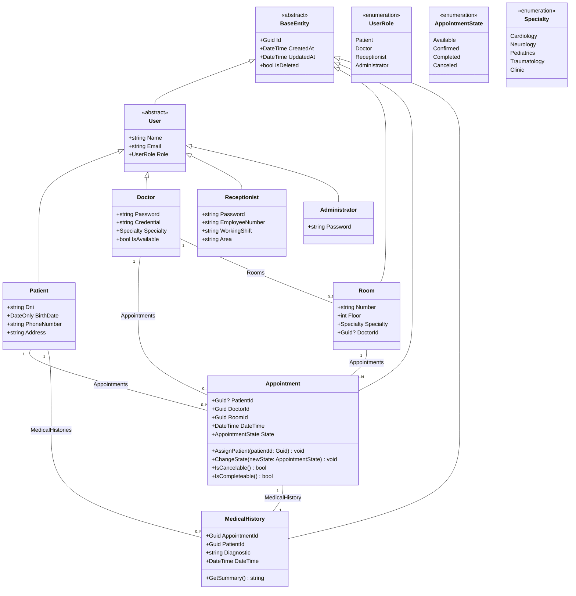

```mermaid
classDiagram
    class BaseEntity {
        <<abstract>>
        +Guid Id
        +DateTime CreatedAt
        +DateTime UpdatedAt
        +bool IsDeleted
    }

    class User {
        <<abstract>>
        +string Name
        +string Email
        +UserRole Role
    }

    class Patient {
        +string Dni
        +DateOnly BirthDate
        +string PhoneNumber
        +string Address
    }

    class Doctor {
        +string Password
        +string Credential
        +Specialty Specialty
        +bool IsAvailable
    }

    class Receptionist {
        +string Password
        +string EmployeeNumber
        +string WorkingShift
        +string Area
    }

    class Administrator {
        +string Password
    }

    class Room {
        +string Number
        +int Floor
        +Specialty Specialty
        +Guid? DoctorId
    }

    class Appointment {
        +Guid? PatientId
        +Guid DoctorId
        +Guid RoomId
        +DateTime DateTime
        +AppointmentState State
        +AssignPatient(patientId: Guid) void
        +ChangeState(newState: AppointmentState) void
        +IsCancelable() bool
        +IsCompleteable() bool
    }

    class MedicalHistory {
        +Guid AppointmentId
        +Guid PatientId
        +string Diagnostic
        +DateTime DateTime
        +GetSummary() string
    }

    class UserRole {
        <<enumeration>>
        Patient
        Doctor
        Receptionist
        Administrator
    }

    class AppointmentState {
        <<enumeration>>
        Available
        Confirmed
        Completed
        Canceled
    }

    class Specialty {
        <<enumeration>>
        Cardiology
        Neurology
        Pediatrics
        Traumatology
        Clinic
    }

    BaseEntity <|-- User
    BaseEntity <|-- Room
    BaseEntity <|-- Appointment
    BaseEntity <|-- MedicalHistory
    
    User <|-- Patient
    User <|-- Doctor
    User <|-- Receptionist
    User <|-- Administrator

    Patient "1" -- "0..N" Appointment : Appointments
    Patient "1" -- "0..N" MedicalHistory : MedicalHistories
    
    Doctor "1" -- "0..N" Appointment : Appointments
    Doctor "1" -- "0..N" Room : Rooms
    
    Room "1" -- "0..N" Appointment : Appointments
    
    Appointment "1" -- "1" MedicalHistory : MedicalHistory
```
